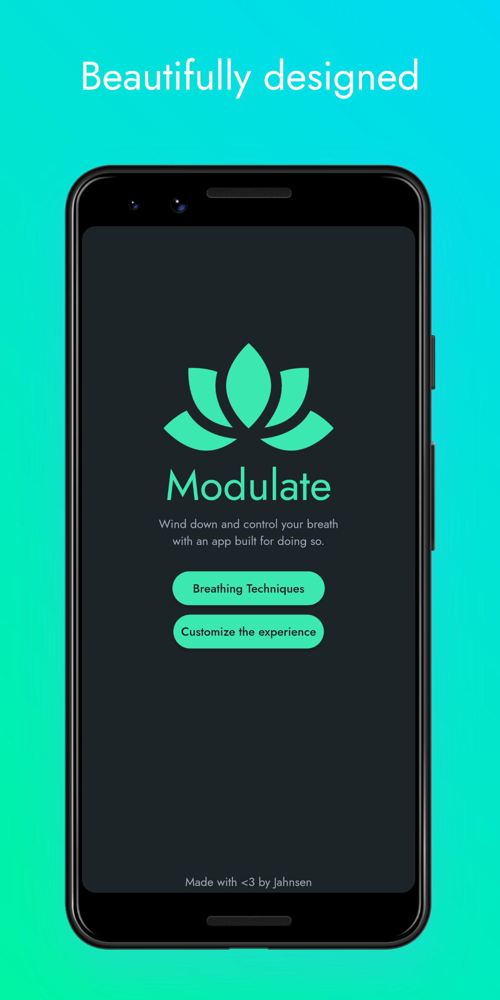

<div align="center">


<br></br>

[](https://flutter.dev/)

[](https://github.com/piupnoin928/Modulate/releases/)

# Modulate

Simple guided breathing app built with Flutter on the FlutterFlow platform.

<br></br>

</div>

<div align="left">

<div align="center">

  

  

  

  

</div>

<br>

</div>

---

## 📥 Download

[](https://github.com/piupnoin928/Modulate/releases/)

---

## 📝 Overview

- [x] User-friendly

- [x] Flutter framework

- [x] Detailed content

- [x] Customized breathing

---

## Building from Source

- If you don't have the Flutter SDK installed, please visit the official [Flutter](https://flutter.dev) site.

- Git clone the repo

```
git clone https://github.com/piupnoin928/Modulate.git
```

- Run the app with Android Studio, or VSCode, or using the command line:

```
flutter pub get
flutter run
```

- To build the app, run:
```
flutter build
```
- The build will be available at: './build/app/outputs/flutter-apk/app-release.apk'

---

## ⚠️ License

    MIT License
    
    Copyright (c) 2024 Jahnsen
    
    Permission is hereby granted, free of charge, to any person obtaining a copy
    of this software and associated documentation files (the "Software"), to deal
    in the Software without restriction, including without limitation the rights
    to use, copy, modify, merge, publish, distribute, sublicense, and/or sell
    copies of the Software, and to permit persons to whom the Software is
    furnished to do so, subject to the following conditions:
    
    The above copyright notice and this permission notice shall be included in all
    copies or substantial portions of the Software.
    
    THE SOFTWARE IS PROVIDED "AS IS", WITHOUT WARRANTY OF ANY KIND, EXPRESS OR
    IMPLIED, INCLUDING BUT NOT LIMITED TO THE WARRANTIES OF MERCHANTABILITY,
    FITNESS FOR A PARTICULAR PURPOSE AND NONINFRINGEMENT. IN NO EVENT SHALL THE
    AUTHORS OR COPYRIGHT HOLDERS BE LIABLE FOR ANY CLAIM, DAMAGES OR OTHER
    LIABILITY, WHETHER IN AN ACTION OF CONTRACT, TORT OR OTHERWISE, ARISING FROM,
    OUT OF OR IN CONNECTION WITH THE SOFTWARE OR THE USE OR OTHER DEALINGS IN THE
    SOFTWARE.

